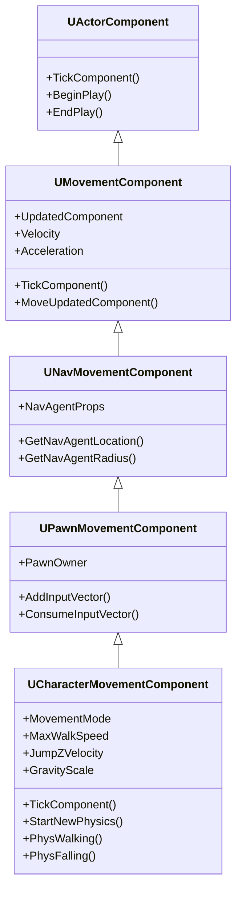
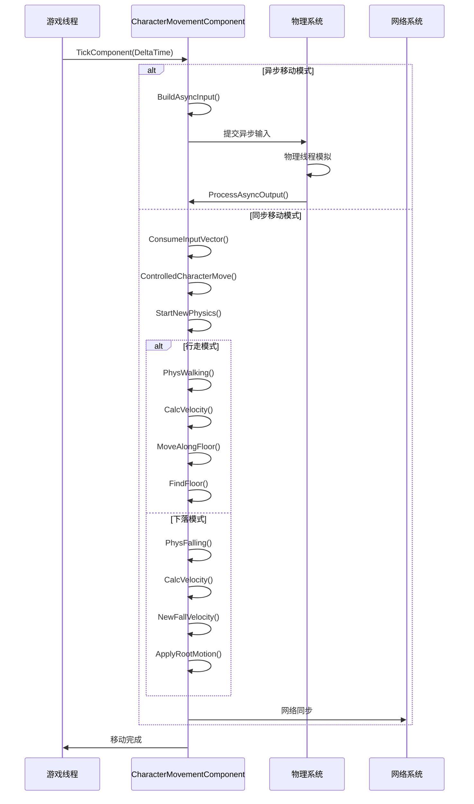
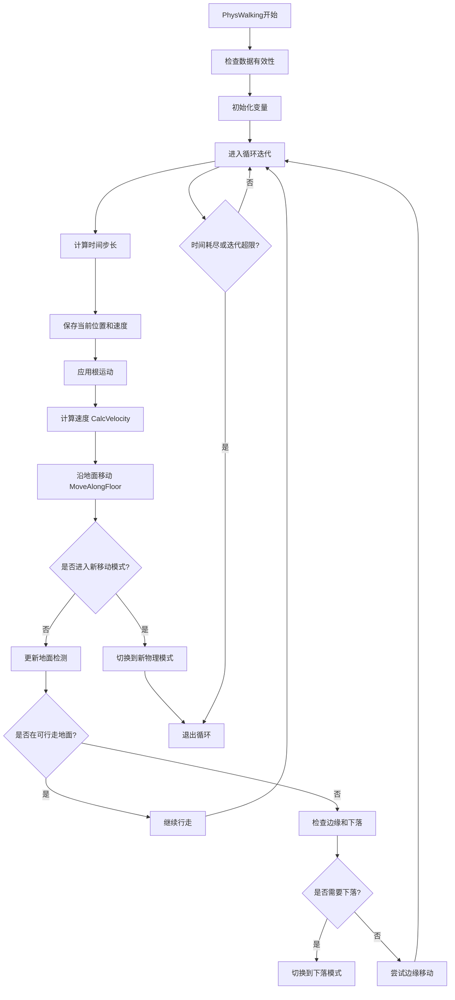
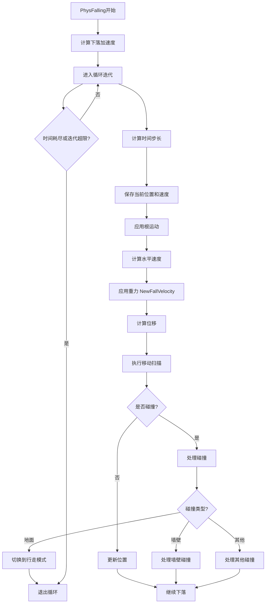
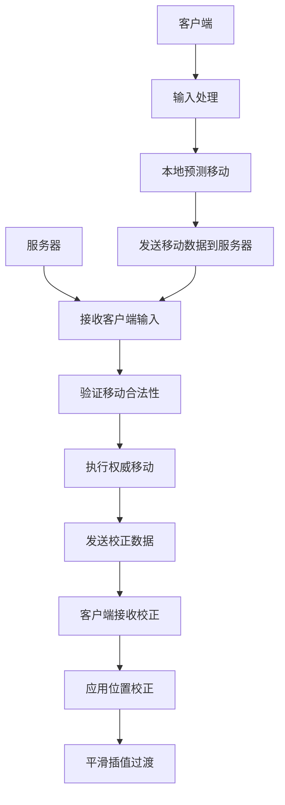

# CharacterMovementComponent 移动原理分析

## 概述

`CharacterMovementComponent` 是 Unreal Engine 5 中负责角色移动的核心组件，它实现了复杂的物理模拟、碰撞检测、网络同步等功能。本文档通过时序图、类图和流程图深入分析其移动原理。

## 类继承层次



## 移动模式 (MovementMode)

`CharacterMovementComponent` 支持 7 种移动模式：

| 模式 | 描述 | 物理模拟方法 |
|------|------|-------------|
| `MOVE_None` | 移动禁用 | 无 |
| `MOVE_Walking` | 地面行走 | `PhysWalking()` |
| `MOVE_NavWalking` | 导航网格行走 | `PhysNavWalking()` |
| `MOVE_Falling` | 下落状态 | `PhysFalling()` |
| `MOVE_Swimming` | 游泳状态 | `PhysSwimming()` |
| `MOVE_Flying` | 飞行状态 | `PhysFlying()` |
| `MOVE_Custom` | 自定义模式 | `PhysCustom()` |

## 移动系统时序图



## 核心移动流程

### 1. TickComponent - 主入口点

```cpp
void UCharacterMovementComponent::TickComponent(float DeltaTime, ELevelTick TickType, FActorComponentTickFunction* ThisTickFunction)
{
    // 1. 消费输入向量
    FVector InputVector = ConsumeInputVector();
    
    // 2. 检查数据有效性
    if (!HasValidData() || ShouldSkipUpdate(DeltaTime)) {
        return;
    }
    
    // 3. 调用父类Tick
    Super::TickComponent(DeltaTime, TickType, ThisTickFunction);
    
    // 4. 根据角色权限执行不同逻辑
    if (CharacterOwner->GetLocalRole() > ROLE_SimulatedProxy) {
        // 控制角色移动
        ControlledCharacterMove(InputVector, DeltaTime);
    } else if (CharacterOwner->GetLocalRole() == ROLE_SimulatedProxy) {
        // 模拟代理移动
        SimulatedTick(DeltaTime);
    }
}
```

### 2. StartNewPhysics - 物理调度器

```cpp
void UCharacterMovementComponent::StartNewPhysics(float deltaTime, int32 Iterations)
{
    switch (MovementMode) {
    case MOVE_Walking:
        PhysWalking(deltaTime, Iterations);
        break;
    case MOVE_Falling:
        PhysFalling(deltaTime, Iterations);
        break;
    case MOVE_Flying:
        PhysFlying(deltaTime, Iterations);
        break;
    case MOVE_Swimming:
        PhysSwimming(deltaTime, Iterations);
        break;
    case MOVE_Custom:
        PhysCustom(deltaTime, Iterations);
        break;
    default:
        break;
    }
}
```

### 3. PhysWalking - 行走物理模拟



### 4. PhysFalling - 下落物理模拟



## 关键算法详解

### 1. 速度计算 (CalcVelocity)

```cpp
void UCharacterMovementComponent::CalcVelocity(float DeltaTime, float Friction, bool bFluid, float BrakingDeceleration)
{
    // 1. 计算期望速度
    FVector DesiredVelocity = GetDesiredVelocity();
    
    // 2. 应用摩擦力
    if (bFluid) {
        // 流体环境下的摩擦力
        Velocity = Velocity * (1.f - FMath::Min(Friction * DeltaTime, 1.f));
    } else {
        // 地面摩擦力
        if (Velocity.SizeSquared() > FMath::Square(BRAKE_TO_STOP_VELOCITY)) {
            Velocity = Velocity - (Velocity * Friction * DeltaTime);
        }
    }
    
    // 3. 应用加速度
    Velocity += Acceleration * DeltaTime;
    
    // 4. 限制最大速度
    float CurrentMaxSpeed = GetMaxSpeed();
    if (Velocity.SizeSquared() > FMath::Square(CurrentMaxSpeed)) {
        Velocity = Velocity.GetSafeNormal() * CurrentMaxSpeed;
    }
}
```

### 2. 地面检测 (FindFloor)

地面检测系统使用射线扫描和胶囊体扫描来检测角色脚下的可行走表面：

- **射线扫描**: 快速检测正下方的地面
- **胶囊体扫描**: 更精确的碰撞检测
- **边缘检测**: 防止角色从边缘掉落
- **坡度检测**: 判断表面是否可行走

### 3. 网络预测和同步机制

`CharacterMovementComponent` 实现了复杂的网络预测和校正系统，这是多人游戏中确保移动同步的关键技术：

#### 网络预测架构



#### 客户端预测流程

```cpp
// 客户端预测移动
void UCharacterMovementComponent::ClientPredictionUpdate(float DeltaTime)
{
    // 1. 保存当前状态用于回滚
    FSavedMovePtr SavedMove = MakeShared<FSavedMove>();
    SavedMove->SaveState(this);
    
    // 2. 执行本地预测
    PerformMovement(DeltaTime);
    
    // 3. 记录预测结果
    SavedMove->PostUpdate(this);
    
    // 4. 添加到预测历史
    MoveHistory.Add(SavedMove);
    
    // 5. 发送移动数据到服务器
    if (ShouldSendMove()) {
        SendMoveToServer(SavedMove);
    }
}
```

#### 服务器验证流程

```cpp
// 服务器验证移动
void UCharacterMovementComponent::ServerMove_Implementation(
    float TimeStamp, 
    FVector_NetQuantize10 InAccel, 
    FVector ClientLoc, 
    uint8 MoveFlags, 
    uint8 ClientRoll, 
    uint32 View, 
    UPrimitiveComponent* ClientMovementBase, 
    FName ClientBaseBoneName, 
    uint8 ClientMovementMode)
{
    // 1. 检查时间戳有效性
    if (!IsValidTimeStamp(TimeStamp)) {
        return;
    }
    
    // 2. 验证移动合法性
    if (!IsMoveValid(InAccel, ClientLoc, MoveFlags)) {
        // 非法移动，进行惩罚或断开连接
        HandleInvalidMove();
        return;
    }
    
    // 3. 执行权威移动计算
    FVector PreMoveLocation = UpdatedComponent->GetComponentLocation();
    
    // 应用客户端输入
    Acceleration = InAccel;
    SetMovementMode(static_cast<EMovementMode>(ClientMovementMode));
    
    // 执行移动
    PerformMovement(GetWorld()->DeltaTimeSeconds);
    
    // 4. 比较结果并发送校正
    FVector ServerLocation = UpdatedComponent->GetComponentLocation();
    if (!ServerLocation.Equals(ClientLoc, PositionTolerance)) {
        // 位置不一致，发送校正
        ClientAdjustPosition(TimeStamp, ServerLocation, Velocity);
    }
}
```

#### 客户端校正处理

```cpp
// 客户端接收校正
void UCharacterMovementComponent::ClientAdjustPosition_Implementation(
    float TimeStamp, 
    FVector NewLoc, 
    FVector NewVel)
{
    // 1. 查找对应的预测记录
    int32 MoveIndex = FindMoveIndexForTimeStamp(TimeStamp);
    
    // 2. 回滚到校正时间点
    if (MoveIndex != INDEX_NONE) {
        // 回滚状态
        MoveHistory[MoveIndex]->RestoreState(this);
        
        // 移除过时的预测记录
        MoveHistory.RemoveAt(0, MoveIndex + 1);
    }
    
    // 3. 应用服务器权威位置
    UpdatedComponent->SetWorldLocation(NewLoc);
    Velocity = NewVel;
    
    // 4. 重新执行预测
    for (auto& Move : MoveHistory) {
        Move->RestoreState(this);
        PerformMovement(Move->DeltaTime);
    }
    
    // 5. 平滑过渡到正确位置
    if (bSmoothCorrections) {
        SmoothCorrection(NewLoc);
    }
}
```

#### 预测优化技术

1. **增量压缩**: 移动数据使用增量编码减少带宽
2. **时间戳同步**: 精确的时间戳管理确保预测准确性
3. **容错处理**: 处理网络延迟和丢包情况
4. **插值平滑**: 使用插值算法平滑位置校正
5. **带宽优化**: 根据网络状况动态调整发送频率

### 4. 根运动同步

根运动系统需要特殊的网络同步处理：

```cpp
// 根运动网络同步
void UCharacterMovementComponent::ApplyRootMotionNetworkSync()
{
    // 客户端预测根运动
    if (CharacterOwner->GetLocalRole() == ROLE_AutonomousProxy) {
        // 预测根运动位移
        FVector RootMotionDelta = ConsumeRootMotionVelocity(DeltaTime) * DeltaTime;
        
        // 应用到移动
        Velocity += RootMotionDelta / DeltaTime;
        
        // 记录根运动信息用于同步
        CurrentRootMotion.Accumulate(RootMotionDelta, DeltaTime);
    }
    
    // 服务器验证根运动
    else if (CharacterOwner->GetLocalRole() == ROLE_Authority) {
        // 验证根运动合法性
        if (!ValidateRootMotion(ClientRootMotionData)) {
            // 根运动不匹配，进行校正
            CorrectRootMotionDiscrepancy();
        }
    }
}
```

## 通过 CharacterMovementComponent 深入学习 C++ 和游戏开发

### 阶段一：C++ 基础与 CharacterMovementComponent 入门 (2-3个月)

**目标**: 掌握 C++ 基础，理解 CharacterMovementComponent 的基本架构

1. **C++ 核心概念** (以 CharacterMovementComponent 为案例)
   - 类与对象: 分析 `UCharacterMovementComponent` 类结构
   - 继承体系: 理解从 `UActorComponent` 到 `UCharacterMovementComponent` 的继承关系
   - 虚函数机制: 研究 `TickComponent()` 等虚函数的实现
   - 模板编程: 学习 UE 中的模板容器如 `TArray`, `TMap`

2. **内存管理实践**
   - 分析 `FSavedMove` 等预测数据结构的内存管理
   - 学习 UE 的智能指针系统 (`TSharedPtr`, `TUniquePtr`)
   - 理解移动系统的内存优化策略

3. **实践项目**: 创建一个简单的移动组件，实现基本的移动功能

### 阶段二：Unreal Engine 核心机制 (3-4个月)

**目标**: 深入理解 UE 特有机制，分析 CharacterMovementComponent 的实现

1. **UObject 系统深度分析**
   - 研究 `UCharacterMovementComponent` 的反射属性 (`UPROPERTY`, `UFUNCTION`)
   - 理解网络复制属性如 `bReplicates`, `ReplicatedUsing` 的实现
   - 分析垃圾回收机制在移动系统中的应用

2. **组件系统与移动架构**
   - 深入阅读 `CharacterMovementComponent.cpp` 源码
   - 理解组件间通信机制 (`GetOwner()`, `GetCharacterOwner()`)
   - 分析移动状态机 (`MovementMode`) 的设计模式

3. **委托和事件系统**
   - 研究移动事件如 `OnMovementModeChanged` 的实现
   - 学习多播委托在移动通知中的应用
   - 实现自定义移动事件系统

4. **实践项目**: 扩展移动组件，添加自定义移动模式和事件

### 阶段三：网络同步与预测系统 (4-5个月)

**目标**: 掌握网络预测技术，深入分析 CharacterMovementComponent 的网络实现

1. **网络预测原理**
   - 详细分析 `ClientPredictionUpdate()` 和 `ServerMove_Implementation()`
   - 学习预测历史管理 (`MoveHistory`, `FSavedMove`)
   - 理解时间戳同步和增量压缩算法

2. **权威验证机制**
   - 研究服务器端移动验证逻辑
   - 分析位置校正 (`ClientAdjustPosition`) 的实现
   - 学习反作弊检测机制

3. **优化技术**
   - 带宽优化: 分析移动数据的网络压缩
   - 性能优化: 研究预测系统的性能瓶颈
   - 延迟补偿: 学习网络延迟处理技术

4. **实践项目**: 实现一个简单的预测移动系统，包含客户端预测和服务器验证

### 阶段四：高级主题与性能优化 (3-4个月)

**目标**: 掌握高级移动特性，进行性能优化和扩展

1. **物理模拟深入**
   - 分析 `PhysWalking()`, `PhysFalling()` 等物理模拟方法
   - 学习碰撞检测优化技术
   - 研究复杂地形的移动处理

2. **根运动集成**
   - 分析根运动与预测系统的集成
   - 学习动画与移动的同步机制
   - 实现自定义根运动系统

3. **性能分析与优化**
   - 使用 UE 性能分析工具分析移动系统
   - 优化预测算法的计算复杂度
   - 内存使用优化和缓存策略

4. **扩展开发**
   - 创建特殊的移动能力 (攀爬、滑行等)
   - 集成第三方物理引擎
   - 开发移动系统的可视化调试工具

### CharacterMovementComponent 核心学习模块

| 学习模块 | 关键技术点 | 相关源码文件 |
|----------|------------|-------------|
| **基础移动** | TickComponent, StartNewPhysics | CharacterMovementComponent.cpp |
| **物理模拟** | PhysWalking, PhysFalling, CalcVelocity | CharacterMovementComponent.cpp |
| **碰撞检测** | FindFloor, MoveAlongFloor | CharacterMovementComponent.cpp |
| **网络预测** | ClientPredictionUpdate, ServerMove | CharacterMovementComponent.cpp |
| **状态管理** | MovementMode 状态机 | CharacterMovementComponent.h |
| **根运动** | ApplyRootMotion, ConsumeRootMotion | CharacterMovementComponent.cpp |
| **优化技术** | 预测历史, 增量压缩, 插值平滑 | SavedMove.h, CharacterMovementComponent.cpp |

### 源码学习路线

1. **第一阶段**: 阅读 `CharacterMovementComponent.h` - 理解类结构和接口定义
2. **第二阶段**: 分析 `TickComponent()` - 掌握移动系统入口点
3. **第三阶段**: 研究 `StartNewPhysics()` - 理解状态机调度
4. **第四阶段**: 深入 `PhysWalking()` 和 `PhysFalling()` - 学习物理模拟
5. **第五阶段**: 分析网络预测相关方法 - 掌握同步机制
6. **第六阶段**: 研究优化技术和高级特性

### 实践项目规划

1. **基础项目**: 创建自定义移动组件，实现基本行走和跳跃
2. **中级项目**: 添加网络预测功能，支持多人同步
3. **高级项目**: 实现特殊移动模式 (游泳、飞行、攀爬)
4. **专家项目**: 开发移动系统优化工具和调试可视化

## 总结

`CharacterMovementComponent` 是一个功能极其丰富的移动系统，它展示了现代游戏引擎中角色移动的复杂性。通过学习其实现，可以深入理解：

- **物理模拟**: 刚体运动、碰撞检测、摩擦力计算
- **状态机设计**: 多种移动模式的切换和管理
- **网络同步**: 客户端预测和服务器验证
- **性能优化**: 迭代计算和碰撞优化
- **扩展性**: 自定义移动模式的实现

这个系统是学习游戏编程和引擎开发的绝佳案例，涵盖了从基础算法到高级架构的各个方面。